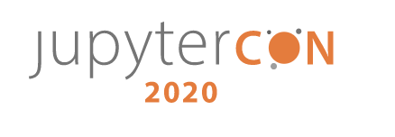

# DESI High :school_satchel:

¡Bienvenido a DESI High!  :school_satchel: Encontraste cuadernos de introducción al Instrumento espectroscópico de energía oscura (DESI) para estudiantes de secundaria, amablemente hospedados por [Binder](https://mybinder.readthedocs.io/en/latest/).  Aquí puedes unirte a nosotros y realizar tus propios experimentos con datos DESI recién extraídos del telescopio :telescope: Para una excelente introducción al proyecto DESI, comienza con este [video](https://www.youtube.com/watch?v=kPXx9tqyzYg) y explora nuestro [sitio web](www.desi.lbl.gov).

Si eres nuevo en python :snake:, ¡no te preocupes! Lo captarás rápidamente. Puedes probar este [libro](https://www.py4e.com/book) para comenzar y asegúrate de mantener nuestras [cheatsheets](https://github.com/michaelJwilson/DESI-HighSchool/tree/master/cheatsheets) cerca para proporcionar algunos resúmenes útiles de los conceptos básicos.

Todo aquí está escrito en cuadernos de Jupyter, lo que facilita todo cuando se trata de Python y ciencia de datos. Puedes leer todo sobre ellos [aquí](www.dataquest.io/blog/jupyter-notebook-tutorial/).

Si te quedas atascado con una pregunta sobre Python, primero sé como los profesionales y prueba www.google.com. Si tienes alguna pregunta científica, déjanos un [mensaje](https://www.github.com/michaelJwilson/DESI-HighSchool/issues/new) y nos comunicaremos contigo.

Cuando hayas terminado, no olvides obtener un crédito adicional dejándonos  lo que [te gustó](https://forms.gle/LGKMVamrtS5StSv56) :star:. Puede mostrar aún más apoyo donando unos pocos :dollar: a nuestra [organización benéfica favorita](https://www.gofundme.com/f/code-nation?utm_source=customer&utm_campaign=p_cp+share-sheet&utm_medium=copy_link_more), ¡pero asegúrate de convencer a tus padres primero!

:rotating_light:  Estamos casi listos para empezar. Primero verás una página de carga, después de la cual podrás probar Espanol/Intro_es.ipynb y luego Espanol/DESI_es.ipynb. En esa etapa ya serás un profesional y podrás probar el resto, SnowWhiteDwarf es uno de nuestros favoritos. Ok, espera para ello, [IR](https://mybinder.org/v2/gh/michaelJwilson/DESI-HighSchool/master)! :rotating_light:

:heart: lo que ves? Obten más información sobre [ver](https://docs.github.com/en/enterprise/2.20/user/github/receiving-notifications-about-activity-on-github/watching-and-unwatching-repositories#watching-a-single-repository) repositorios y recibirás una actualización cuando agreguemos nuevos experimentos. Si has creado los tuyos propios, ¡nos encantaría verlos! Prueba ["tu primer commit"](https://www.medium.com/@haydar_ai/learning-how-to-git-creating-your-first-commit-c753ed2e7498), o simplemente [hablanos de ello](https:/www.github.com/michaelJwilson/DESI-HighSchool/issues/new).

  
  
  

