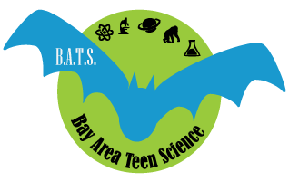

# DESI High: School of the Dark Universe

[![alt text][timage]][thyperlink]
[![alt text][iimage]][ihyperlink]
[![alt text][fimage]][fhyperlink]
[![alt text][rimage]][rhyperlink]

[thyperlink]: https://twitter.com/intent/tweet?text=Wow!%20Unbelievable%20what's%20possible%20at%20@desisurvey's%20DESI%20High.%20%20Can't%20wait%20to%20get%20started!%0Dhttps://github.com/michaelJwilson/DESI-HighSchool/
[timage]: desihigh/images/Twitter_buttonsize2.png

[fhyperlink]: https://www.facebook.com/sharer.php?s=100&p[url]=github.com%2FmichaelJwilson%2FDESI-HighSchool&p[title]=Dark%20Energy%20Science%20with%20hot-off-the-telescope%20data!
[fimage]: desihigh/images/Facebook_buttonsize.png

[ihyperlink]: https://instagram.com
[iimage]: desihigh/images/Instagram_buttonsize.png

[rhyperlink]: http://reddit.com/submit?url=github.com%2FmichaelJwilson%2FDESI-HighSchool&title=Dark%20Energy%20Science%20with%20hot-off-the-telescope%20data!
[rimage]: desihigh/images/Reddit_buttonsize.png

:mexico:  **¡Hola! Para nuestros amigos de habla hispana, querrá consultar [README](https://github.com/michaelJwilson/DESI-HighSchool/blob/main/Espanol/README.md)** :es:

Welcome to DESI High!  :school_satchel: You've found introductory notebooks to the Dark Energy Spectroscopic Instrument (DESI) for high schoolers, kindly hosted by [Binder](https://mybinder.readthedocs.io/en/latest/).  Here you can join us and run your own experiments with hot-off-the-telescope DESI data :telescope:  For a great introduction to the DESI project, start with this [video](https://www.youtube.com/watch?v=kPXx9tqyzYg), try our [website](https://www.desi.lbl.gov) and sign up to our [Twitter feed](https://twitter.com/desisurvey)!

If you're new to python :snake:, don't worry!  You'll pick it up quickly.  You can try this [book](https://www.py4e.com/book) to get started and be sure to keep our [cheatsheets](https://github.com/michaelJwilson/DESI-HighSchool/tree/main/cheatsheets) directory close by to provide some handy summaries of the basics.

Everything here is written in [Jupyter notebooks](https://jupyter.org/), which makes all things easy when it comes python and data science.  You can read all about them [here](https://www.dataquest.io/blog/jupyter-notebook-tutorial/).

:rotating_light::rotating_light:  *We're almost ready to get started.  You'll first see a loading page, after which you'll want Intro.ipynb and then DESI.ipynb.  By that stage you'll know the basics and can try the rest - SnowWhiteDwarf is one of our favourites.  Ok, wait for it, [GO](https://mybinder.org/v2/gh/michaelJwilson/DESI-HighSchool/1.2.6)!* :rotating_light::rotating_light:

If you get stuck with python, join the pros and try www.google.com!  :thought_balloon: If you have a science question,
leave us a [message](https://github.com/michaelJwilson/DESI-HighSchool/issues/new/) and we'll get back to you.  But remember, all staff and students at DESI High abide by the [Code of Conduct](https://github.com/michaelJwilson/DESI-HighSchool/blob/main/CODE_OF_CONDUCT.md) :scroll:.  

Special thanks to [@alxogm](https://github.com/alxogm), [@mmarianav](https://github.com/mmarianav), [@cylammarco](https://github.com/cylammarco) and the other contributors for helping put this together.  A++ for effort! 

:heart: what you see?  Earn extra credit by telling us your favourite part of [DESI High](https://forms.gle/LGKMVamrtS5StSv56) :star:.  Find out about [watching](https://docs.github.com/en/enterprise/2.20/user/github/receiving-notifications-about-activity-on-github/watching-and-unwatching-repositories#watching-a-single-repository) repositories and you'll get an update when we add new experiments.  If you've created your own, we'd love to see them!  Try ['your first commit'](https://www.medium.com/@haydar_ai/learning-how-to-git-creating-your-first-commit-c753ed2e7498).

:school:  Have a classroom full of students potentially interested in DESI High?  We have an elite team of scientists from across the globe ready to get things   <a href="mailto:desihighinitiative@gmail.com?subject=Meet a scientist:">started for you</a>!  Meet one of our [existing partner schools](https://github.com/michaelJwilson/DESI-HighSchool/tree/main/Partners/Lowell) :earth_africa:. 

:whale:  For budding developers, we support [Docker](https://hub.docker.com/r/mjwilsonlbl/desihigh), [Travis CI](https://travis-ci.com/github/michaelJwilson/DESI-HighSchool) and [Anaconda Cloud](https://anaconda.org/michaeljwilson/desi-high) :cloud:. 

:mortar_board:  If you've studied all there is to know, it may be time to take [The Test](https://github.com/michaelJwilson/DESI-HighSchool/blob/main/TheTest/README.md) and [graduate](https://github.com/michaelJwilson/DESI-HighSchool/blob/main/Graduation/README.md) from DESI High!

  
  
  
  
  
  
  

  

